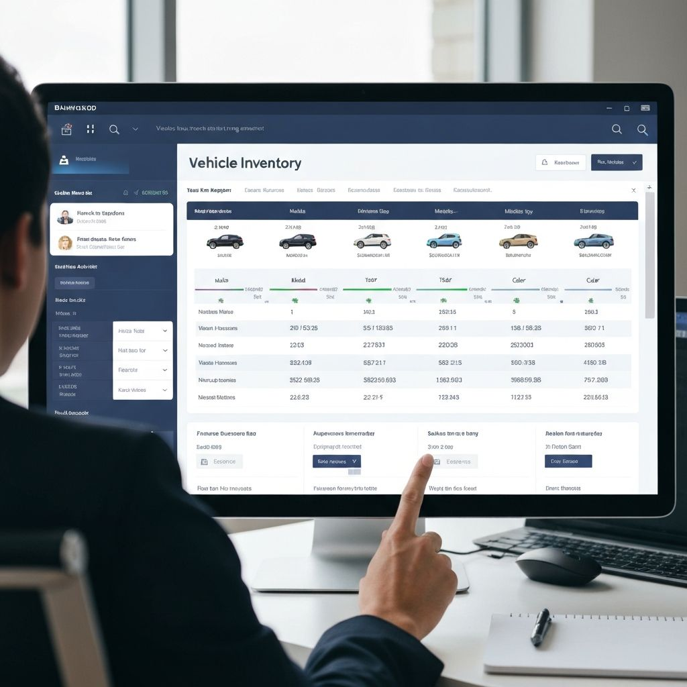

# ✅ Solução para Imagem do Hero Section

## 📋 Problema Identificado:

A imagem não aparece em aba anônima porque o caminho pode estar incorreto ou a imagem não está no servidor.

## ✅ Correções Aplicadas:

### 1. **Fallback Visual Automático**
- Se a imagem não carregar, aparece automaticamente um fallback elegante
- Mantém o visual azul consistente com o design
- Mostra ícone e texto "AutoStock Dashboard"

### 2. **Tratamento de Erro Robusto**
- Sistema detecta automaticamente quando a imagem falha
- Logs no console para facilitar diagnóstico
- Fallback aparece instantaneamente

## 🔍 Verificar se a Imagem Existe no Servidor:

### Teste 1: Acesso Direto

Abra no navegador (aba anônima):
```
https://nerdparadise.com.br/public/car-dealership-dashboard-interface-showing-vehicle.jpg
```

**Resultados possíveis:**
- ✅ **Imagem aparece** = Arquivo existe, problema é no caminho do HTML
- ❌ **404 Not Found** = Arquivo não está no servidor
- ❌ **403 Forbidden** = Problema de permissões

### Teste 2: Verificar Estrutura de Pastas

Certifique-se de que no servidor (Hostinger) existe:

```
public_html/
├── index.html
├── public/
│   └── car-dealership-dashboard-interface-showing-vehicle.jpg ✅
```

### Teste 3: Console do Navegador

1. Abra o site em aba anônima
2. F12 → Console
3. Procure por:
   - `⚠️ Imagem não carregou: public/car-dealership-dashboard-interface-showing-vehicle.jpg`

## 🛠️ Soluções:

### Solução 1: Verificar Upload da Imagem

Certifique-se de que fez upload da imagem:
- Pasta: `public/`
- Nome: `car-dealership-dashboard-interface-showing-vehicle.jpg`
- Permissões: `644`

### Solução 2: Usar URL Absoluta (Se caminho relativo não funcionar)

Edite `index.html` linha ~116:

```html
<!-- Trocar de: -->


```

### Solução 4: Usar Placeholder Temporário

Enquanto não resolve, pode usar um placeholder:

```html

```

## ✅ O que já está funcionando:

- ✅ **Fallback visual** aparece automaticamente se imagem falhar
- ✅ **Cores e layout** funcionam perfeitamente (já corrigido)
- ✅ **Tratamento de erro** detecta e responde automaticamente
- ✅ **Console mostra avisos** para facilitar diagnóstico

## 📝 Importante:

**O fallback garante que o site não quebra**, mesmo se a imagem não carregar. O visual continua elegante e profissional.

Para ter a imagem real aparecendo, certifique-se de que:
1. O arquivo existe no servidor em `public/car-dealership-dashboard-interface-showing-vehicle.jpg`
2. As permissões estão corretas (644)
3. O caminho no HTML está correto


