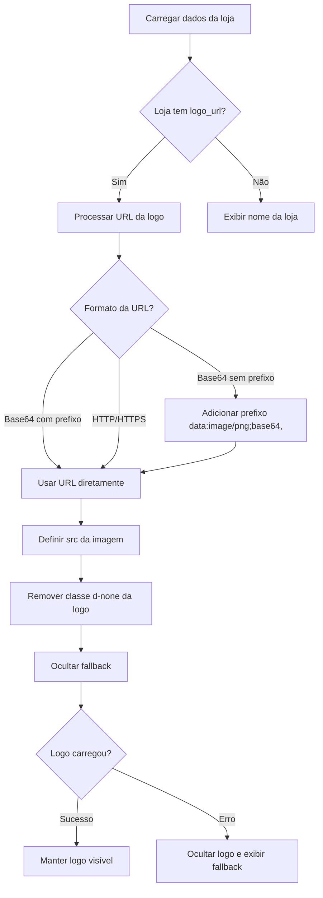

# 📸 Documentação: Estrutura da Logo no Catálogo Público (loja.html)

## 📋 Visão Geral

Este documento descreve a estrutura HTML, CSS e JavaScript da logo exibida no catálogo público (`loja.html`). A logo é carregada dinamicamente através de JavaScript e possui um sistema de fallback para exibir o nome da loja quando a logo não estiver disponível.

---

## 🏗️ Estrutura HTML

### Localização
**Arquivo:** `loja.html`  
**Seção:** Header do catálogo público (linhas 344-353)

### Código HTML

```html
<!-- Header Clean - REQ-FR-LP-001 4.1 -->
<header class="main-header">
    <div class="container">
        <div class="d-flex justify-content-between align-items-center flex-wrap gap-3">
            <div class="header-logo-wrapper">
                <div class="header-logo-container">
                    
                    <h1 class="h5 mb-0 fw-normal text-muted d-none" id="storeNameHeaderFallback">Carregando...</h1>
                </div>
            </div>
            
            <!-- Navegação do header -->
            <div class="d-flex align-items-center gap-4 header-nav">
                <a href="#veiculos">Comprar carros</a>
                <a href="#sobre">Sobre a loja</a>
                <a href="#contato">Contato</a>
                <a href="#" class="header-whatsapp-btn d-none" id="headerWhatsAppBtn" target="_blank">
                    <i class="bi bi-whatsapp me-2"></i>WhatsApp
                </a>
            </div>
        </div>
    </div>
</header>
```

### Elementos da Estrutura

| Elemento | ID/Classe | Descrição |
|----------|-----------|-----------|
| **Wrapper Principal** | `.header-logo-wrapper` | Container externo que isola a logo do header |
| **Container Interno** | `.header-logo-container` | Container com flexbox para alinhamento |
| **Imagem da Logo** | `#storeLogoHeader` | Elemento `` que exibe a logo (inicialmente oculto) |
| **Fallback Texto** | `#storeNameHeaderFallback` | Texto de fallback com nome da loja (inicialmente oculto) |

---

## 🎨 Estrutura CSS

### Localização
**Arquivo:** `loja.html` (estilos inline) e `assets/css/style.css` (estilos globais)  
**Linhas:** 32-45 (loja.html) e 527-551 (style.css)

### Estilos Desktop

```css
/* Wrapper principal da logo */
.header-logo-wrapper {
    display: flex;
    align-items: center;
    padding: 0.25rem 0;
}

/* Container interno da logo */
.header-logo-container {
    display: flex;
    align-items: center;
    justify-content: flex-start;
    padding: 0;
}

/* Imagem da logo */
.header-logo {
    max-height: 150px;
    max-width: 600px;
    width: auto;
    height: auto;
    object-fit: contain;
    display: block;
}
```

### Estilos Mobile/Tablet

```css
@media (max-width: 991.98px) {
    .header-logo-wrapper {
        padding: 0.15rem 0;
    }
    
    .header-logo {
        max-height: 100px;
        max-width: 400px;
        width: auto;
        height: auto;
    }
}
```

### Propriedades CSS Explicadas

| Propriedade | Valor | Descrição |
|-------------|-------|-----------|
| `max-height` | `150px` (desktop) / `100px` (mobile) | Altura máxima da logo |
| `max-width` | `600px` (desktop) / `400px` (mobile) | Largura máxima da logo |
| `width: auto` | - | Mantém proporção original |
| `height: auto` | - | Mantém proporção original |
| `object-fit: contain` | - | Garante que a imagem caiba dentro dos limites sem distorção |
| `display: block` | - | Remove espaços inline e permite melhor controle |

---

## ⚙️ Funcionalidade JavaScript

### Localização
**Arquivo:** `assets/js/loja.js`  
**Função:** `displayStoreInfo(store)` (linhas 96-231)

### Código JavaScript

```javascript
// Display store information
function displayStoreInfo(store) {
    // Check if store is active
    if (store.is_active === false || store.is_active === 0) {
        showStoreUnavailable();
        return;
    }
    
    // Header - Logo (prioridade) ou Nome (fallback)
    const storeLogoHeader = document.getElementById('storeLogoHeader');
    const storeNameHeaderFallback = document.getElementById('storeNameHeaderFallback');
    
    if (store.logo_url && store.logo_url.trim() !== '') {
        // Garantir que logo_url tenha prefixo data: se for base64
        let logoUrl = store.logo_url.trim();
        if (!logoUrl.startsWith('data:') && !logoUrl.startsWith('http://') && !logoUrl.startsWith('https://')) {
            // Provavelmente base64 sem prefixo, adicionar
            logoUrl = `data:image/png;base64,${logoUrl}`;
        }
        
        storeLogoHeader.src = logoUrl;
        storeLogoHeader.alt = store.name || 'Logo da loja';
        storeLogoHeader.classList.remove('d-none');
        
        // Esconder fallback quando logo carregar
        if (storeNameHeaderFallback) {
            storeNameHeaderFallback.classList.add('d-none');
        }
        
        // Tratamento de erro - mostrar fallback se logo falhar
        storeLogoHeader.onerror = function() {
            this.classList.add('d-none');
            if (storeNameHeaderFallback) {
                storeNameHeaderFallback.textContent = store.name || 'Loja';
                storeNameHeaderFallback.classList.remove('d-none');
            }
        };
        
        // Quando logo carregar com sucesso, garantir que fallback está escondido
        storeLogoHeader.onload = function() {
            if (storeNameHeaderFallback) {
                storeNameHeaderFallback.classList.add('d-none');
            }
        };
    } else {
        // Sem logo - mostrar nome como fallback
        storeLogoHeader.classList.add('d-none');
        if (storeNameHeaderFallback) {
            storeNameHeaderFallback.textContent = store.name || 'Loja';
            storeNameHeaderFallback.classList.remove('d-none');
        }
    }
    
    // ... resto do código ...
}
```

### Fluxo de Funcionamento



### Tratamento de Erros

1. **Logo não carrega:** Se a imagem falhar ao carregar (`onerror`), o sistema automaticamente:
   - Oculta a imagem da logo
   - Exibe o nome da loja como fallback

2. **Logo carrega com sucesso:** Quando a logo carrega (`onload`), o sistema:
   - Garante que o fallback está oculto
   - Mantém a logo visível

3. **Sem logo_url:** Se a loja não tiver logo configurada:
   - A imagem permanece oculta
   - O nome da loja é exibido como fallback

---

## 📐 Dimensões e Proporções

### Desktop
- **Altura máxima:** 150px
- **Largura máxima:** 600px
- **Proporção:** Mantém proporção original da imagem
- **Padding wrapper:** 0.25rem (top/bottom)

### Mobile/Tablet (≤ 991.98px)
- **Altura máxima:** 100px
- **Largura máxima:** 400px
- **Proporção:** Mantém proporção original da imagem
- **Padding wrapper:** 0.15rem (top/bottom)

### Recomendações de Upload
- **Resolução ideal:** 600-800px de largura
- **Proporção recomendada:** 2:1 ou 3:1 (horizontal)
- **Formatos suportados:** PNG, JPG, SVG
- **Tamanho máximo:** 2MB
- **Fundo:** Transparente (recomendado)

---

## 🔄 Estados da Logo

### Estado Inicial
```html

<h1 id="storeNameHeaderFallback" class="h5 mb-0 fw-normal text-muted d-none">Carregando...</h1>
```
- Ambos os elementos começam ocultos (`d-none`)
- `src` da imagem está vazio
- Texto de fallback mostra "Carregando..."

### Estado com Logo
```html

<h1 id="storeNameHeaderFallback" class="h5 mb-0 fw-normal text-muted d-none">Carregando...</h1>
```
- Logo visível (sem `d-none`)
- `src` preenchido com URL base64 ou HTTP
- Fallback oculto

### Estado sem Logo (Fallback)
```html

<h1 id="storeNameHeaderFallback" class="h5 mb-0 fw-normal text-muted">Nome da Loja</h1>
```
- Logo oculta
- Fallback visível com nome da loja

---

## 🎯 Formatos de URL Suportados

### 1. Base64 com Prefixo
```
data:image/png;base64,iVBORw0KGgoAAAANS...
```

### 2. Base64 sem Prefixo
```
iVBORw0KGgoAAAANS...
```
*O sistema adiciona automaticamente o prefixo `data:image/png;base64,`*

### 3. URL HTTP/HTTPS
```
https://exemplo.com/logo.png
http://exemplo.com/logo.jpg
```

---

## 🔧 Manutenção e Customização

### Alterar Tamanho Máximo da Logo

**Desktop:**
```css
.header-logo {
    max-height: 150px;  /* Alterar aqui */
    max-width: 600px;   /* Alterar aqui */
}
```

**Mobile:**
```css
@media (max-width: 991.98px) {
    .header-logo {
        max-height: 100px;  /* Alterar aqui */
        max-width: 400px;   /* Alterar aqui */
    }
}
```

### Alterar Alinhamento

```css
.header-logo-container {
    justify-content: flex-start;  /* left */
    justify-content: center;      /* center */
    justify-content: flex-end;    /* right */
}
```

### Adicionar Efeitos Hover

```css
.header-logo:hover {
    opacity: 0.8;
    transition: opacity 0.3s ease;
}
```

---

## 📱 Responsividade

A logo se adapta automaticamente a diferentes tamanhos de tela:

- **Desktop (> 991.98px):** Logo maior (150px altura, 600px largura)
- **Tablet (768px - 991.98px):** Logo média (100px altura, 400px largura)
- **Mobile (< 768px):** Logo menor (100px altura, 400px largura)

O wrapper também ajusta o padding para economizar espaço em telas menores.

---

## 🐛 Troubleshooting

### Logo não aparece
1. Verificar se `logo_url` está preenchido no banco de dados
2. Verificar console do navegador para erros de carregamento
3. Verificar se a URL base64 está completa (não truncada)
4. Verificar se o formato da imagem é suportado

### Logo aparece muito pequena
1. Verificar dimensões máximas no CSS
2. Verificar se a imagem original tem resolução adequada
3. Ajustar `max-height` e `max-width` conforme necessário

### Fallback não aparece quando logo falha
1. Verificar se o evento `onerror` está sendo disparado
2. Verificar se `storeNameHeaderFallback` existe no DOM
3. Verificar se a classe `d-none` está sendo removida corretamente

---

## 📚 Arquivos Relacionados

- **HTML:** `loja.html` (linhas 344-353)
- **CSS:** `loja.html` (linhas 32-45) e `assets/css/style.css` (linhas 527-551)
- **JavaScript:** `assets/js/loja.js` (função `displayStoreInfo`)
- **API:** `api/endpoints/stores.php` (endpoint que retorna dados da loja)

---

## ✅ Checklist de Implementação

- [x] Estrutura HTML criada
- [x] Estilos CSS definidos (desktop e mobile)
- [x] JavaScript de carregamento implementado
- [x] Sistema de fallback funcional
- [x] Tratamento de erros implementado
- [x] Suporte a base64 e URLs HTTP
- [x] Responsividade configurada
- [x] Proporção original mantida
- [x] Limites máximos definidos

---

## 📝 Notas Adicionais

- A logo é isolada em um wrapper próprio (`header-logo-wrapper`) para melhor controle
- O sistema prioriza a logo, mas sempre tem um fallback funcional
- A logo mantém sua proporção original independente do tamanho
- O sistema suporta tanto imagens base64 quanto URLs externas
- Compatível com todos os navegadores modernos

---

**Última atualização:** 2024  
**Versão:** 1.0  
**Autor:** Sistema Estocx
